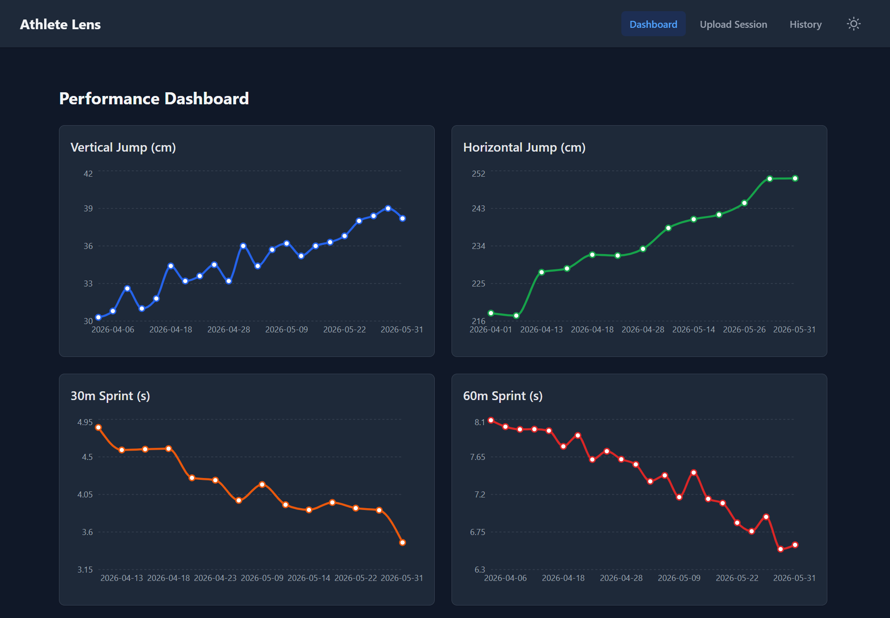
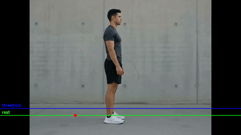
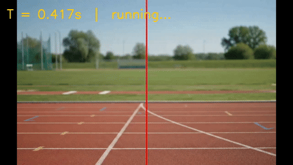

# Athlete Lens

A self-hosted biomechanical analysis suite for tracking athletic performance over time. Processes video to extract physical metrics (vertical jump height, sprint time, horizontal jump distance) and stores them to visualise progress across a season.

Built as a portfolio project. Designed for single-athlete personal use, running on a laptop and accessible from a phone via Cloudflare Tunnel.

---

**[→ Live demo](https://athlete-lens.netlify.app)** sample data, no backend required.

<a href="https://athlete-lens.netlify.app">

</a>

---

## What it measures

| Module | Input | Output |
|---|---|---|
| **Vertical jump** | Video (CMJ, side-on) | Jump height (cm), flight time (ms) |
| **Sprint** | Video (finish-line cam) | Sprint time (s) |
| **Horizontal jump** | Manual entry | Jump distance (cm) |

---

## Vertical jump



The phone records a countermovement jump from the side. YOLOv8 Pose tracks ankle keypoints (15/16) frame by frame. Takeoff and landing frames are detected from the Y-trajectory using a relative threshold. Jump height is derived from flight time:

```
h = g · t² / 8
```

→ [Technical decisions: vertical module](backend/core/vertical/README.md)

---

## Sprint



The phone is placed at the finish line. A countdown timer gives the athlete time to reach the starting position. Three audible beeps mark T = 0; recording starts on the third beep. YOLOv8 Pose detects the frame where the athlete's hip center (keypoints 11/12) crosses the horizontal midpoint. Sprint time = `crossing_frame / fps`.

Direction is inferred automatically from the first detected frame. No manual configuration needed regardless of which side the phone faces.

→ [Technical decisions: sprint module](backend/core/sprint/README.md)

---

## Horizontal jump

Distance is entered manually after measuring with a tape. No video processing.

---

## Stack

| Layer | Technology |
|---|---|
| Backend | FastAPI, SQLAlchemy, SQLite, Python 3.12+ |
| Computer vision | YOLOv8 Pose (`ultralytics`, `yolov8n-pose.pt`) |
| Frontend | React 19, Vite, Tailwind CSS v4, Recharts |
| Package manager | `uv` (Python), `npm` (JS) |
| Mobile access | Cloudflare Tunnel |

---

## Requirements

- Python 3.12+
- Node.js 18+
- [`uv`](https://github.com/astral-sh/uv): installed automatically by `setup.sh` if missing
- (Optional) [`cloudflared`](https://developers.cloudflare.com/cloudflare-one/connections/connect-networks/downloads/): for mobile access

**Hardware:** any machine capable of running YOLOv8 inference. CUDA is used automatically if available; CPU fallback processes a typical video in ~10 s, which is acceptable for personal-use frequency.

---

## Installation

```bash
git clone https://github.com/JoseGarciaMayen/athlete-lens.git
cd athlete-lens
```

Copy the environment file:

```bash
cp frontend/.env.example frontend/.env
```

For local use only the defaults work as-is. For mobile access via Cloudflare Tunnel, fill in your public URLs (see [Mobile access](#mobile-access)).

---

## Running

```bash
# Local only
./setup.sh

# With Cloudflare Tunnel (mobile access)
./setup.sh --tunnel
```

`setup.sh` installs all dependencies on first run, then starts the backend (port 8000) and frontend (port 5173) concurrently.

Open [http://localhost:5173](http://localhost:5173) in your browser.

---

## Mobile access

Athlete Lens can be installed as a PWA (Progressive Web App) on Android via Chrome's "Add to home screen". iOS Safari support for camera recording via `MediaRecorder` is limited; manual entry is available as a fallback for all modules.

### Setup (one-time)

1. [Create a Cloudflare account](https://dash.cloudflare.com/sign-up) and add your domain.
2. Install [`cloudflared`](https://developers.cloudflare.com/cloudflare-one/connections/connect-networks/downloads/).
3. Authenticate and create a tunnel:

```bash
cloudflared tunnel login
cloudflared tunnel create athlete-lens
```

4. Create `~/.cloudflared/config.yml`:

```yaml
tunnel: <your-tunnel-uuid>
credentials-file: /root/.cloudflared/<your-tunnel-uuid>.json

ingress:
  - hostname: your-api-domain.com
    service: http://localhost:8000
  - hostname: your-frontend-domain.com
    service: http://localhost:5173
  - service: http_status:404
```

5. Route DNS:

```bash
cloudflared tunnel route dns athlete-lens your-frontend-domain.com
cloudflared tunnel route dns athlete-lens your-api-domain.com
```

6. Update `frontend/.env` with your public URLs (see `.env.example`).

### Usage

```bash
./setup.sh --tunnel
```

Open your frontend domain on the phone. Chrome will offer to install the app.

---

## Project structure

```
athlete-lens/
├── backend/
│   ├── api/
│   │   ├── main.py             # FastAPI app, lifespan, CORS
│   │   └── routes/             # vertical, sprint, horizontal, sessions
│   ├── core/
│   │   ├── vertical/           # YOLOv8 ankle tracking + flight-time math
│   │   └── sprint/             # YOLOv8 hip crossing detection
│   ├── db/
│   │   ├── models.py
│   │   ├── crud.py
│   │   └── database.py
│   └── tests/
├── frontend/
│   ├── src/
│   │   ├── pages/              # Dashboard, Upload, History
│   │   └── components/         # UploadVertical, UploadSprint, UploadHorizontal
│   └── public/                 # PWA manifest, service worker, icons
└── setup.sh
```

---

## Contributing

→ [CONTRIBUTING.md](CONTRIBUTING.md)

---

## License

MIT
